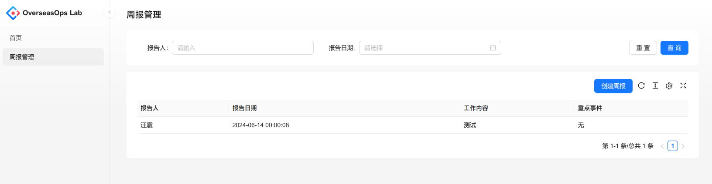

# 初始化仓库

```shell
git init
echo "venv\n.idea\n.local" > .gitignore
git add .
git commit -m "initial commit"
```

# 安装基于Python的后端的依赖

首先需要初始化venv环境

```shell
python3 -m venv venv
source venv/bin/activate
```
如果您使用IDE，可以基于IDE的功能来初始化venv环境。注意，本实验基于Python 3.11。

然后安装依赖

```shell
pip install fastapi==0.103.1 uvicorn==0.23.2 pydantic==2.3.0 SQLAlchemy==2.0.20 pydantic-settings==2.0.3 pyhumps==3.8.0 fastapi-pagination==0.12.9 asyncpg==0.28.0
# output the installed dependencies to requirements.txt
pip freeze > requirements.txt
```

# 后端骨架代码

代码内容参见`backend`目录。使用如下命令启动后端服务：

```shell
uvicorn backend.main:app --reload --port 6001
```

测试后端服务是否正常运行：

```shell
curl http://127.0.0.1:6001
# {"message":"Welcome to OverseasOps Lab"}
```

# 示例后端业务模块

在这里，我们将实现一个简单的后端业务模块，用于管理周报。假设每个周报有：报告人、报告日期、本周工作内容、重点事件。

数据模型定义在`backend/models/reports.py`中，这个模型不仅仅定义了数据结构，还包含了增删改查的领域逻辑，属于所谓的“充血模型”。

MVC架构中的控制器定义在`backend/api/reports/routes.py`中，这个控制器定义了增删改查的HTTP接口。

为了简化，此Lab我们不引入Service层，直接在控制器中调用模型的方法。

需要注意一下入口点中的这段代码：

```
@app.on_event("startup")
async def startup():
    async with async_engine.begin() as conn:
        await conn.run_sync(Base.metadata.create_all)
```

它用于在数据库中执行DDL语句，创建数据表。这段代码会在服务启动时执行。

启动服务后， 您现在可以在 http://127.0.0.1:6001/docs 看到Swagger UI，API基于OpenAPI 3规范暴露。

# 安装基于TypeScript的前端的依赖

假设你已经安装了Node.js v18.19和NPM。

执行如下命令安装前端依赖：

```shell
mkdir frontend
cd frontend
npm install yarn
export PATH=./node_modules/.bin:$PATH
yarn create umi
# 选择 Ant Design Pro、yarn、npm
```
等待依赖安装完成即可。

# 前端代码骨架

现在我们要对上述命令生成的前端代码进行一些修改，以适应我们的需求。

1. 修改一些UI元素，比如页面标题等
2. 去掉一些不需要的页面
3. 配置从何处读取OpenAPI定义，以便生成API调用代码

现在，我们可以使用如下命令启动前端服务：

```shell
cd frontend
yarn start
```

# 示例前端业务模块

在这里，我们将实现一个简单的前端业务模块，用于管理周报。假设每个周报有：报告人、报告日期、本周工作内容、重点事件这些字段。

## 生成API调用Stubs

因为后端已经实现了增删改查的接口，我们需要自动生成前端stub代码，以便调用这些接口：
```shell
yarn max openapi

```
此命令完成后，会在 `frontend/src/services/lab` 目录下生成对应的API调用代码。

## 编写前端页面

前端页面放在`frontend/src/pages` 目录下，我们在这个目录下创建一个`Reports`目录，用于存放周报管理相关的页面。

模块的入口文件为`Reports/index.tsx`。

## 注册路由

需要在`frontend/config/routes.ts`中注册路由，这样前端路由系统才能找到我们的页面。

## 启动前端服务 

启动前端服务后，您可以在浏览器中访问 http://localhost:8000/reports 来查看周报管理页面。


